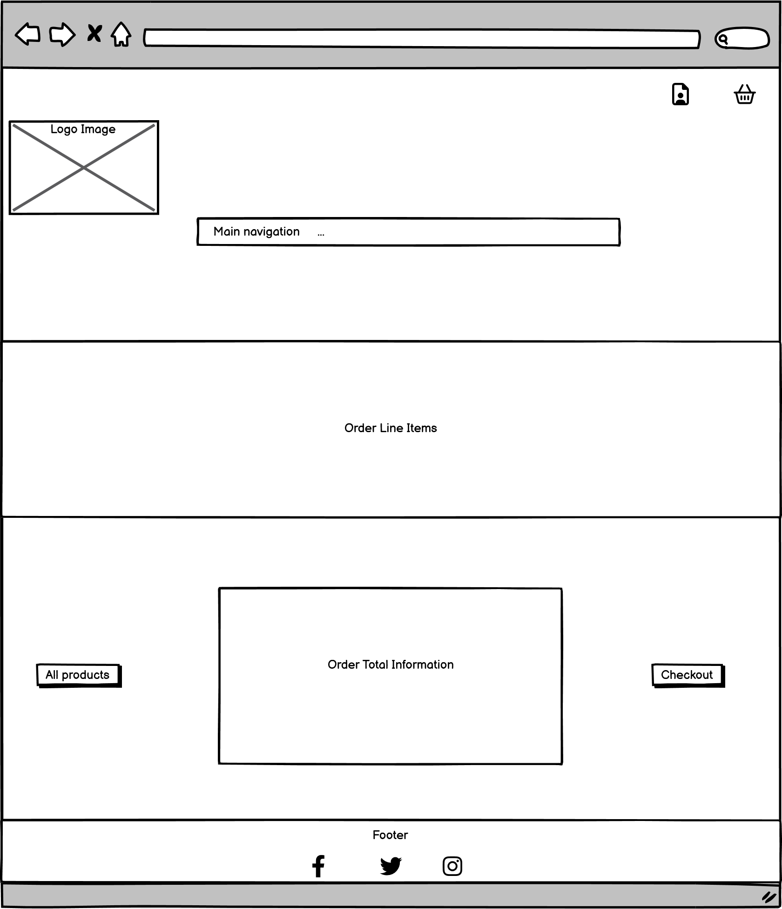

# Oenotrus Online Wine Store

## Table of Contents

1. **Introduction**
2. **Structure**
3. **Design**
4. **Limitations**
5. **Features**
6. **Technologies**
7. **Development Lifecycle**
8. **Testing**
9. **Deployment**
10. **Usage**
11. **Collaboration**
12. **Acknowledgments**
13. **Further Development**
14. **Final Notes**

### Introduction

Oenotrus is a full stack web application designed for the Unit 4 project in the Code Institute Gateway Qualifications Level 5 Diploma in Web Application Development course. It provides the user (browsers, shoppers and wine enthusiasts) with a fully functional online store presenting a small range of handpicked wines covering some of the most popular categories in the market.

As a B2C e-commerce platform Oenotrus provides the framework for business users to present, market and sell their stock of wines direct to consumers, who are able to browse, select and purchase the available wines online in an aesthetically pleasing, responsive and fully functional website across all common devices and browsers.

The live website can be found here <https://oenotrus-b46392d15346.herokuapp.com/>

### Structure

##### Architecture

Gym Logger is built with HTML5, custom CSS, JavaScript and Python in the Django full-stack framework to create a responsive and interactive full-stack web application which also contains back-end functionality that allows users to create, store and manipulate relevant data records.

##### User Experience Design

For first time users I want the site to be easily navigable and the products easily browsable, laid out in a clear, concise and yet attractive way combining sufficient information and CTAs to satisfy the business user's desire to sell and the customer's desire to make an informed purchase.

For first time users I want to offer simple functionality to create an account and store their information including order history, default delivery details and wishlisted products. This will facilitate new purchases for the business user

For returning customers I want them to quickly be able to access their wishlisted wines and order history. This will help provide the business user with repeat orders.
For returning customers I want them to be able to review their purchases in such a way as to provide extra incentive for new customers to browse the site and place their first orders.

###### UX Design Principles

###### User Stories

##### Navigation

The full stack application consists of a landing homepage with a hero background image with top navigation, a footer, and a simple and clear call to action taking the user to the full wine list. The navigation dropdown allows the user to view all wines, but also to browse by specific category, and also to navigate to specials based on extra criteria.

The main wines page is sortable and allows the user to filter by relevant criteria, or perform a specific search. Product images along with key information is displayed and each product contains a link to a full detail page for the wine in question.

From their users can add to cart if they are customers or shoppers, or if they are admin users they can edit/delete products from this detail page. The cart page contains the product image, main product details, price, line subtotal and full total. The checkout page consists of a submittable form with Stripe integration.

There is also a profile page where registered customers can view their order history. Additional functionality is provided where registered users can see a wishlist of wines they would like to purchase, and leave reviews for wines they have already bought and tasted.

Pages extend the base template for consistency.

### Design

##### Colour Scheme

Over a white background Gold #e3c69f is the main accent colour, supported by a Maroon #741515 . Colours from Bootstrap classes are also used for user confirmations and notifications.

##### Typography

For clarity the main font used is Montserrat.

##### Imagery

The Oenotrus logo is deployed in the header of all pages for consistency and brand visibility and is responsive for different screensizes.

##### Wireframes

###### Homepage/Landing Page

###### Products Page

###### Products Detail Page

###### User Profile Page

###### Shopping Cart Page

###### Checkout Page

### Limitations

Stripe currently the only linked API

### Features

- Responsive main navigation bar
- Filter product functions and search bar
- Dropdown for new and registered users
- Register and login functions
- Linked database
- Full add to cart and checkout functionality
- Wishlist and review functionality
- User confirmations
- Further information pages

### Technologies

- **HTML** This project uses HTML as the main language used to complete the structure of the website.
- **CSS** This project uses custom written CSS to style the Website.
- **JavaScript/JQuery** This project uses custom written JavaScript to add interactive elements to the website and allow the user to achieve their goals.
- **Bootstrap** The Bootstrap framework is used throughout this website for layouts and styling. This has also been used to import JavaScript/JQuery where necessary.
- **Python** This project uses Python to communicate with the database allowing the recording and manipulation of user data.
- **Django**
- **ElephantSQL** - Postgres Database created with MongoDB
- **Font Awesome** Font awesome Icons are used in the Body of the site and for the Social media links contained in the Footer section of the website.
- **Google Fonts** Google fonts are used throughout the project to import the fonts.
- **Gitpod** The IDE used throughout development
- **GitHub** GithHub is the hosting site used to store the source code for the Website.
- **Heroku** Deploys the live version of the application.
- **Google Chrome Developer Tools** Google Chrome's built in developer tools are used to inspect page elements and help debug issues with the site layout and test different CSS styles.
- **Balsamiq Wireframes** This was used to create wireframes for 'The Skeleton Plane' stage of UX design.
- **place-hold.it** Place-hold.it was used to display the colours shown in the Color Scheme section. 
- **Lucid Chart** Chart was used to create the diagrams for Use Case scenarios, UX Design Principles, and Project Lifecycle planning.

### Development Lifecycle

#### Iteration 1
- Inception: the shopping user is considering to purchase wines online. The business user is a wine shop owner looking for a new sales channel.
- Task: the developer/programmer creates a base template from which to extend the relevant framework demonstrating the layour and functionality of the site.
- Increment: the developer creates a HTML framework within Django, setting up Allauth framewrork and a home app along with responsive nav bar header.

#### Iteration 2
- Inception: the shopping user would like to browse available wines, search for something specific, or peruse based on category. The business user has provided a set of products potentially meeting this demand.
- Task: to meet this need the developer/programmer creates a framework to show these products and their appeal, as well as begin the ordering flow.
- Increment: the developer/programmer creates the product app to show the full list and detail of available wines, along with search and filter functions and an add to cart app.

#### Iteration 3
- Inception: the shopping user would like to complete their purchase of selected wines.
- Task: to meet this need the developer/programmer creates the checkout function along with stripe integration, and the user profile to store delivery information and order history
- Increment: cart and checkout apps created with verification and user confirmation, then the propfile app. Product admin functionality created for the business user.

#### Iteration 4
- Inception: the shopping user has completed their purchase and would like to continue viewing the site, adding their thoughts and plans for future orders.
- Task: to meet this need the developmer/programmer creates further functionality for user feedback and ongoing usage.
- Increment: wishlist and review functionality created. Heroku deployment prepared. Testing and bug fixes finalised. Heroku final deployment.

#### Initial Data Model

### Testing

#### Strategy

The project depends upon the ability to store and manipulate information provided by each user. Testing is therefore firstly designed to ensure that all input elements function correctly, are validated, and stored in a usable format. These inputs need to be contained in a framework meeting responsivity and accessibility guidelines, so procedures to ensure this will also be implemented. Users will need to see all of their information in one place so testing procedures to ensure all actions are confirmed and then displayed on the profile page will also be devised.

All elements should remain on the screen at sizes above 300px. All internal nav links should direct to the correct pages. All external links should open in a new window. All form inputs should be validated on submission. Form results should vary depending on user submitted information.

All testing conducted on live deployed pages.

#### Initial Bugs (pre-deployment)

- On product detail pages the increase item quantity button would only increase the quantity in the cart but not in the box on the product page. Solved with function handleEnableDisable.
- Subtotal not correctly showing in cart page initially, solved by adding a missing trailing slash in JS
- Initially the background image shown on the homepage would show on all other pages. Solved by using blan overlays with CSS class.
- A horizontal line positioning bug on the all product page was identified and solved through css - margin auto and important tag.

#### Manual Testing

### Further Development

- Subscribe to new products
- Repeat order function
- Forgot password feature
- Shipping information
- Special offers and new arrivals